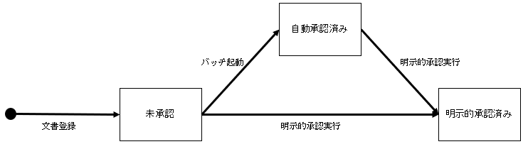

# 文書管理

PLAT では文書のステータスと[権限](./manage_permissions.md)で文書情報へのアクセスを制御している。

## 1. 文書の状態遷移

| ステータス     | 条件                                                | スタッフ     | 患者     |
| :------------- | :-------------------------------------------------- | :----------- | :------- |
| 未承認         | 文書の新規登録                                      | 更新・参照可 | 利用不可 |
| 自動承認済み   | 文書登録後、一定時間経過後にバッチ処理にて更新（※） | 参照のみ     | 利用不可 |
| 明示的承認済み | 明示的承認処理を実行                                | 参照のみ     | 参照のみ |

（※）医療機関、文書種別ごとに設定可能
