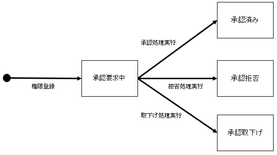

# 権限管理

PLAT 内では各データに対して付与された権限のパターン、権限の有効性によってアクセス可能か判定している。
また、権限削除 API によって削除した権限は無効になり、他の API で参照不可となる。

## 1. 権限の状態遷移

| ステータス | 条件                             | 権限の有効性 |
| :--------- | :------------------------------- | :----------: |
| 承認要求中 | 権限の新規登録                   |      ×       |
| 承認済み   | 承認要求中に権限承認処理を実行   |      〇      |
| 承認拒否   | 承認要求中に権限拒否処理を実行   |      ×       |
| 承認取下げ | 承認要求中に権限取下げ処理を実行 |      ×       |

| 論理削除フラグ | 条件                               | 権限の有効性 |
| :------------- | :--------------------------------- | :----------: |
| 未削除         | 権限の新規登録                     |      〇      |
| 削除済み       | 承認済みの権限に権限削除処理を実行 |      ×       |
