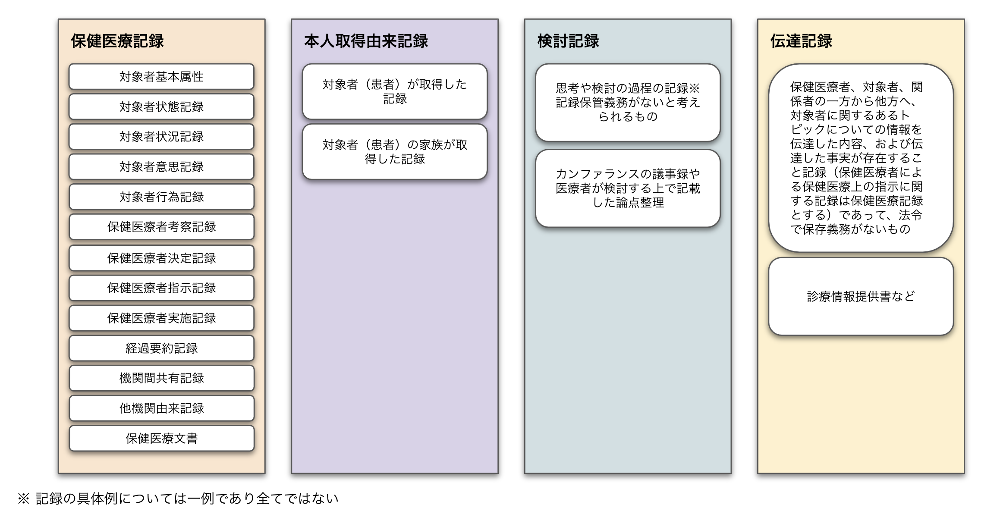

# 概要

## PLAT とは

以下の３つの基本コンセプトを実現する将来の健康医療情報記録管理システムである。

（１）本人主体管理  
個⼈に基づく健康医療情報を、医療提供機関単位ではなく本人（患者等）単位で１記録として作成し、それを原則として恒常的に預かる組織が運用されることを前提として、本人が管理する。  
（２）本人・医療提供者間での情報共用  
本人と医療提供者は、個⼈に基づく健康医療情報を、本人が明示的に拒否する場合を除き、本人の受ける医療のために共用できる。  
（３）自他共栄  
本人と関係医療者は、本人以外への医療提供や、より良い医療を開発して医学医療の発展に貢献する目的で、個人に基づく健康医療情報が仮名化されて管理され、個人情報保護に配慮して安全に利用されることを、原則として承認する。  
  
３つの基本コンセプトを実現するため、大きく「記名記録管理システム」と「仮名化記録管理システム」からなり、  
「記名記録管理システム」についてはローカル、リモートの２つから構成される。  
（※）現在の公開資材範囲に含まれるものは、以下の「記名記録管理システム」となります。  

- 記名記録管理システム…論理的に保健医療機関等が管理を行う業務記録としての保健医療記録、対象者(患者)が管理を行う健康医療記録の二種類の記録を管理する。
    - ローカル…各医療機関側に設置するPLATのシステム。直近一定機関の保健医療記録を管理する。
    - リモート…各医療機関のマスタとして機能し全記録を管理、また対象者が管理を行う健康医療記録を管理するPLATのシステム。
-  仮名化記録管理システム…「対象者が管理する健康医療記録」に対し仮名化処理した情報を管理する。  

<!-- PLAT とは〜  
共通プラットフォーム指針 -->

## PLAT ができること

- HL7 FHIRの活用：可能な限りHL7 FHIRに準拠したリソース(リソースコレクションであるバンドルリソースを含む)を、REST-APIにより登録し、また取得するものとする。HL7 FHIRにあったては、日本実装モデルであるOpen FRUCtoSを活用する。

- ローカル - リモートでの同期：各医療機関に設置されるローカルに情報が記録された際、同時にリモートへも同期される。合わせてリモートに直接 情報が記録された場合にもローカルへ同期をとる。 ローカルにて管理する情報は直近一定期間のみの情報とし、リモートを全記録を管理するマスタとして扱う。これによりネットワーク遮断時等においても医療機関として直近一定機関の保健医療記録にアクセスでき、最小限の記名記録を可能とすることを保証できるようにする。

- リモートにおける健康保険情報の管理：次の二種類の記録が管理することができる。  
    1)保健医療機関等が管理を行う業務記録としての保健医療記録  
            保健医療機関等が記録する保健医療記録は、これに属する記録として管理される。この記録は、記録と同時に速やかに2)で管理される記録として論理的8にコピーされる。  
    2)対象者(患者)が管理を行う健康医療記録  
            保健医療機関等が記録する保健医療記録の論理的なコピーはこれに属し、コピー元の記録とは論理的には別の記録として管理される。また、対象者が記録する本人取得由来記録はこれに属する記録として管理される。  

<!-- FHIR 形式で〜（FRUCtoS も織り交ぜる）  
local - remote の説明  
認証〜  
同期も軽く触れる -->

## PLAT 利用者

- 医療機関スタッフ
- ユーザ（患者含む）

<!-- 医療機関や患者 -->

## PLAT で扱う記録の種類

PLATが管理する健康医療記録の概念を、以下のように整理する。
健康医療記録は、特定の対象者(一般的には患者)に関する記録であり保健
(健診、検診、予防接種、保健指導、自己健康管理など)、医療、介護に関する
記録を含み、これを以下の4つの記録区分に分類する。   
  
1.保健医療記録 : 保健医療福祉関連の有資格者が、その資格により提供が認められている保健医療福祉関連の業務を提供し、その業務の一環として対象者について把握したり分析したり、その資格にもとづいて対象者に行為を直接または間接的に提供した内容に関する情報、それにより発生した情報を記録したもの  
  
2.本人取得由来記録 : 対象者について何らかの情報を記録したもののうち、対象者(患者)あるいは対象者の家族などが取得し記録した情報  
  
3.検討記録  : 保健医療者、対象者、関係者らが対象者に関するトピックについて一人で検討あるいは当事者同士で協議した内容の記録のうち、保健医療記録とまではいえない思考や検討の過程を記録したものや、当事者同士で医療記録としないことが合意されているものであって、法令では診療録・診療諸記録としてみなされず、記録保管義務がないと考えられるもの
  
4.伝達記録  : 保健医療者、対象者、関係者の一方から他方へ、対象者に関するあるトピックについての情報を伝達した内容、および伝達した事実が存在すること記録であって、法令で保存義務がないもの
  
　　

<!-- 図解の絵を流用してもいいかも  
健康医療記録については https://std.jpfhir.jp/ に記載されている Bundle 構造を参照させる -->
