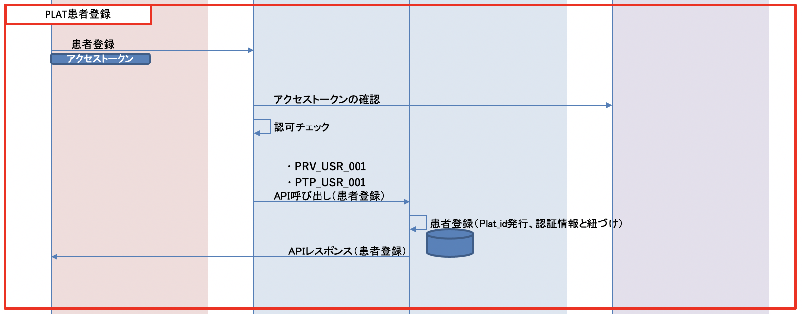
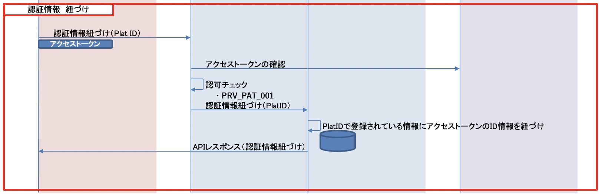
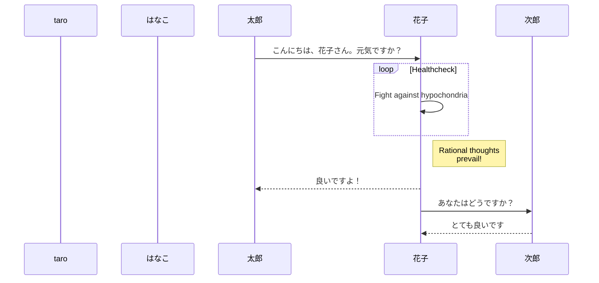

---
sidebar_label: "PLATユーザ登録"
sidebar_position: 11
---

# PLAT ユーザ登録

PLAT にて新規ユーザ登録、ID紐づけを行う。
なお、PLAT では登録されたPatientリソースを管理する。

## 1. 医療機関による登録

1. 医療機関の管理者 または 医師によるユーザ登録

   - 自病院に対してのPLAT の新規ユーザ登録
   [PLAT API 01.マスタ系] - [Local] - [PRV_USR_001：【登録】ユーザ情報（医療機関用）]に登録したいユーザの情報を入力し管理者 または 医師のトークンで実行する。
   （管理者のトークン発行については[Postman の実行（ユーザ認証〜API アクセスまで各環境の一気通貫確認）](../Usage/operation_check.md) を参照）

   - PLAT 共通 ID と自病院の患者 ID との紐づけ
   [PLAT API 01.マスタ系] - [Local] - [PRV_PAT_001：【登録】PLAT患者情報（医療機関用）.md]に紐づけしたいユーザの情報を入力し管理者 または 医師のトークンで実行する。

## 2. 患者による登録

   - 患者自身のPLAT の新規ユーザ登録
   [PLAT API 01.マスタ系] - [Patient] - [PTP_USR_001：【登録】ユーザ情報（患者用）]に登録したいユーザの情報を入力し患者のトークンで実行する。
   （患者のトークン発行については[Postman の実行（ユーザ認証〜API アクセスまで各環境の一気通貫確認）](../Usage/operation_check.md) を参照）

### 3. フロー

   - 新規ユーザ登録
   

   - PLAT 共通 ID と自病院の患者 ID との紐づけ
   

