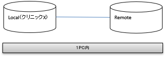
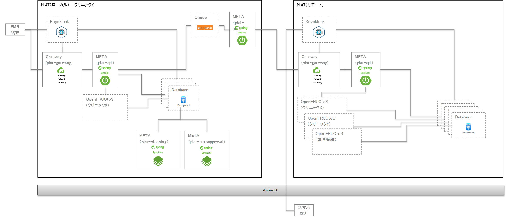

# 新規に基盤を構築する

## 1. 概要

本手順では１つの OS 上でローカル及びリモートの動作環境を構築する手順を記載する。

## 2. 事前準備

- Docker for Windows のインストール ※ Mac の場合は Docker Desktop をインストール
- Docker Compose のインストール
- Git for Windows のインストール ※ Windows のみ。Mac の場合は GNU Bash を利用
- Docker for Windows(Mac 版の場合は Docker Desktop)を立ち上げる。
- Mac で構築する際の追加対応事項 - Docker Desktop の[Preferences][resources][Advanced]
  を開き、下記の値を設定する - CPUs : 5 - Memory : 14.50 GB - Swap : 3.5 GB - docker-compose ファイルを Mac 用にチューニングされたものに書き換える - `etc/docker-compose-for-mac`にあるファイルを、localX, localY, remote フォルダにある docker-compose ファイルにそれぞれコピーする  
   例：localX の場合  
   `# cp etc/docker-compose-for-mac/docker-compose-localX.yml localX/docker-compose.yml`

## 3. 構成

本手順を実施することで以下の環境をローカル PC 上に構築する。

### 3.1. 簡易構成



### 3.2. 詳細構成



## 4. 環境情報

| 環境名         | フォルダ名 | メモリ使用量 |
| -------------- | ---------- | ------------ |
| リモート環境   | remote     | 4 GB         |
| ローカル環境 X | localX     | 5 GB         |

## 5. 手順

### 5.1. Docker の実行（remote）

1.  GitBash(Mac 版の場合はターミナル)を起動し、plat-release フォルダに移動

    ```
    # cd ./plat-release
    ```

1.  シェルを起動し、Docker の起動を行う

    ```
    # ./docker_start.sh remote
    ```

1.  シェルを起動し、PLAT への初期データ登録を行う

    ```
    # ./docker_data_of.sh remote
    ```

:::note

- 構築した Docker コンテナを Docker for Windows あるいは Docker Desktop 上で削除する場合は、json フォルダ内の`*.registered`ファイルを全て削除する

:::

### 5.2. Docker の実行（localX）

1.  シェルを起動し、Docker の起動を行う

    ```
    # ./docker_start.sh localX
    ```

1.  シェルを起動し、PLAT への初期データ登録を行う

    ```
    # ./docker_data_of.sh localX
    ```

### 5.3. 動作確認

[利用手順 / Postman でのアプリケーション疎通確認](../Usage/operation_check.md)
