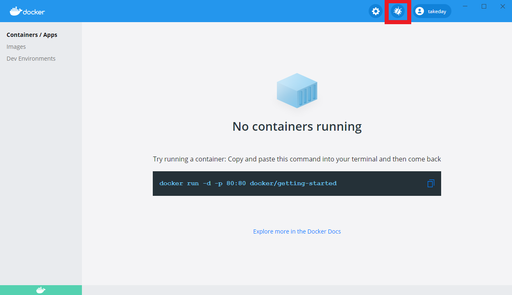
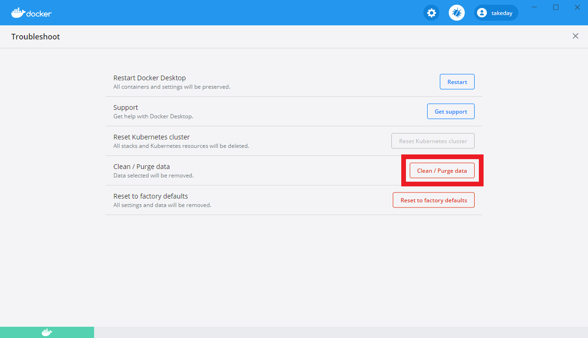
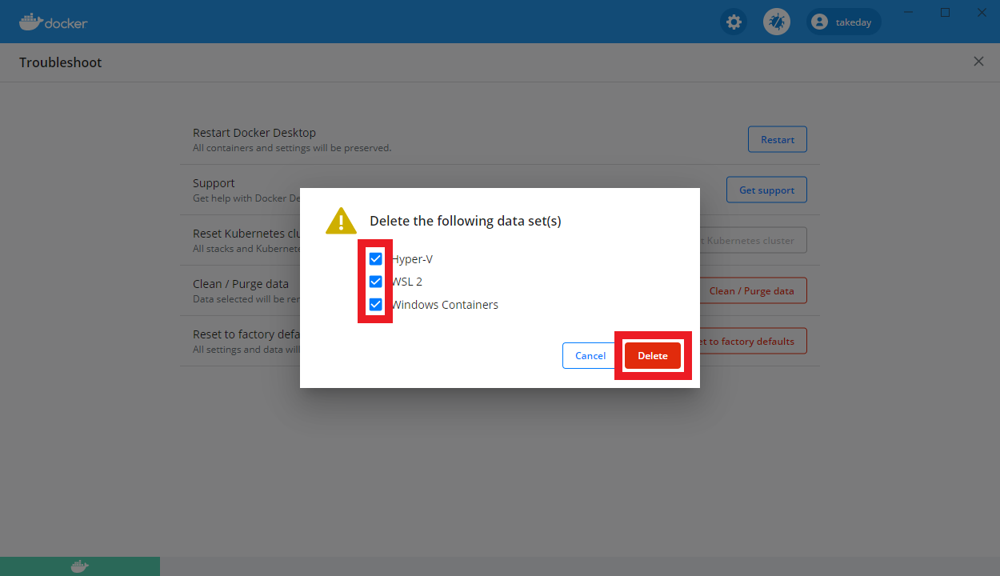

# 環境の初期化手順

## 1. 初期化手順

### 1.1. 過去に PLAT 環境を構築済みで PLAT 環境のみ再作成する場合

1. 起動中の Docker コンテナを停止

   - remote

   ```
   # docker stop remote_plat-db remote_keycloak-db remote_openfructos-db-1 remote_openfructos-db-2 remote_openfructos-audit-db-1 remote_openfructos-audit-db-2 remote_keycloak remote_openfructos-tomcat-1 remote_openfructos-tomcat-2 remote_plat-gateway remote_plat-api
   ```

   - localX

   ```
   # docker stop localX_plat-db localX_keycloak-db localX_openfructos-db localX_openfructos-audit-db localX_rabbitmq localX_keycloak localX_openfructos-tomcat localX_plat-gateway localX_plat-api localX_plat-mq localX_plat-sync localX_plat-autoapproval localX_plat-cleaning
   ```

   - localY

   ```
   # docker stop localY_plat-db localY_keycloak-db localY_openfructos-db localY_openfructos-audit-db localY_rabbitmq localY_keycloak localY_openfructos-tomcat localY_plat-gateway localY_plat-api localY_plat-mq localY_plat-sync localY_plat-autoapproval localY_plat-cleaning
   ```

1. Docker のイメージを削除

   - remote

   ```
   # docker rm remote_plat-db remote_keycloak-db remote_openfructos-db-1 remote_openfructos-db-2 remote_openfructos-audit-db-1 remote_openfructos-audit-db-2 remote_keycloak remote_openfructos-tomcat-1 remote_openfructos-tomcat-2 remote_plat-gateway remote_plat-api
   ```

   - localX

   ```
   # docker rm localX_plat-db localX_keycloak-db localX_openfructos-db localX_openfructos-audit-db localX_rabbitmq localX_keycloak localX_openfructos-tomcat localX_plat-gateway localX_plat-api localX_plat-mq localX_plat-sync localX_plat-autoapproval localX_plat-cleaning
   ```

   - localY

   ```
   # docker rm localY_plat-db localY_keycloak-db localY_openfructos-db localY_openfructos-audit-db localY_rabbitmq localY_keycloak localY_openfructos-tomcat localY_plat-gateway localY_plat-api localY_plat-mq localY_plat-sync localY_plat-autoapproval localY_plat-cleaning
   ```

   - 以下コマンドを実行し、ローカル DB データファイルを削除

   ```
   # docker volume rm $(docker volume ls -qf dangling=true)
   ```

### 1.2. Docker コンテナ自体を完全に初期化する場合

- Docker for Desktop の上部にある虫アイコンを押下し、Troubleshoot 画面を開く。  
  

- [Clean / Purge data]を押下  
  

- 全てチェックし、[Delete]を押下  
  
