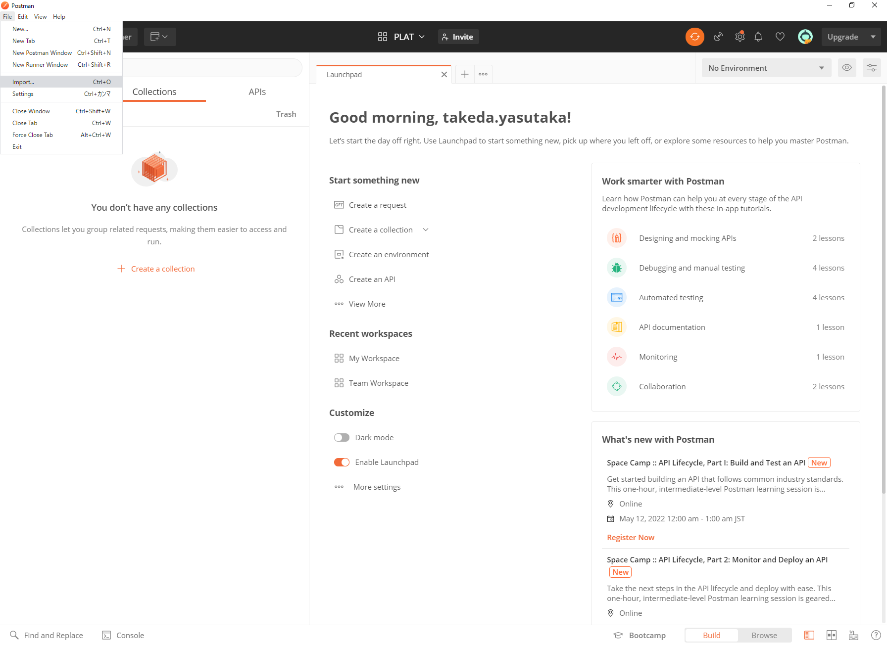

# Postman でのアプリケーション疎通確認

## 1. 概要

PLAT 環境の構築後に動作確認をするための手順を記載する。

## 2. 事前準備

- Postman のインストール

## 3. 手順

### 3.1. Postman に設定ファイルを読み込む

1. Postman を起動し[File] [Import] を押下する。  
   

2. [Upload Files] を押下し、処理定義（planets-lib/postman/collection 配下）のファイルをインポートする。

   - PLAT 疎通確認.postman_collection.json

3. [Upload Files] を押下し、環境変数（planets-lib/postman/environment 配下）のファイルをインポートする。

   - PLAT リリース環境.postman_environment.json

### 3.2. KeyCloak の設定

管理コンソールからユーザを登録（詳細な手順は [KeyCloak へのユーザ登録手順](../Tips/add_keycloak_user.md) を参照）

1.  左のメニューから Users を開き、localclinicx.admin ユーザを生成する。（ユーザ名、メールアドレスは任意で良い）

2.  再び Users を開き、View all users を押下すると作成したユーザが表示される。

3.  ユーザのリンクをクリックし、Credentials タブでパスワードを設定する。  
    （値は localclinicx.admin、Temporary は OFF にして Reset Password を押下する）

## 3.3. Postman の実行（ユーザ認証〜API アクセスまで各環境の一気通貫確認）

1. ユーザ認証（管理ユーザ：localclinicx.admin）  
   1.1. Postman の [PLAT 疎通確認] - [LocalX] - [①COM_ATH_001.【認証】認証エンドポイント] を開き、Send ボタンを押下する。  
   1.2. Postman の Console に以下の様な URL が生成されるので、"http"以降をコピーして Web ブラウザで開く。

   ```
   GET http://localhost:8184/auth/realms/1310000001/protocol/openid-connect/auth?client_id=plat-public&scope=openid&response_type=code&redirect_uri=http://localhost:18182/callback&code_challenge=E9Melhoa2OwvFrEMTJguCHaoeK1t8URWbuGJSstw-cM&code_challenge_method=S256
   ```

   1.3. localclinicx.admin でサインインすると画面に認可コードが表示されるのでクリップボード等に保持しておく。

   ```
   8979899a-8a6e-4155-9115-d3dfe23b64af.b76fe821-d095-4a30-86d0-74f1dd5d8471.5a3c96e3-34cd-4dd6-a984-ff868b4f0eea
   ```

   1.4. Postman の [PLAT 疎通確認] - [LocalX] - [②COM_ATH_003.【認証】トークン取得] を開き、Body タブの code（下図!!!replace_me!!!の箇所）に 1.3. で取得した認可コードを設定して Send ボタンを押下する。  
   

2. スタッフの登録  
   2.1. Postman の [PLAT 疎通確認] - [LocalX] - [③PRV_STF_003.【登録】スタッフ管理（認証情報まで一括登録）] を開き、Send ボタンを押下する。  
   ※ 正常にレスポンスが返ってくれば ID：localclinicx.doctor0001、パスワード：localclinicx.doctor0001 のユーザが KeyCloak に登録されている。

3. ユーザ認証（スタッフ：localclinicx.doctor0001）  
    3.1. Postman の [PLAT 疎通確認] - [LocalX] - [④COM_ATH_001.【認証】認証エンドポイント] を開き、Send ボタンを押下する。  
    3.2. Postman の Console に以下の様な URL が生成されるので、"http"以降をコピーして Web ブラウザで開く。  
   （パスワードの再設定を求められた場合、「localclinicx.doctor0001」を設定する）

   ```
   GET http://localhost:8184/auth/realms/1310000001/protocol/openid-connect/auth?client_id=plat-public&scope=openid&response_type=code&redirect_uri=http://localhost:18182/callback&code_challenge=E9Melhoa2OwvFrEMTJguCHaoeK1t8URWbuGJSstw-cM&code_challenge_method=S256
   ```

   3.3. localclinicx.doctor0001 でサインインすると画面に認可コードが表示されるのでクリップボード等に保持しておく。

   ```
   8979899a-8a6e-4155-9115-d3dfe23b64af.b76fe821-d095-4a30-86d0-74f1dd5d8471.5a3c96e3-34cd-4dd6-a984-ff868b4f0eea
   ```

   3.4. Postman の [PLAT 疎通確認] - [LocalX] - [⑤COM_ATH_003.【認証】トークン取得] を開き、Body タブの code（下図!!!replace_me!!!の箇所）に 3.3. で取得した認可コードを設定して Send ボタンを押下する。  
    

4. 組織一覧を取得  
   Postman の [PLAT 疎通確認] - [LocalX] - [⑥PRV_ORG_001.【取得】文書情報が存在する医療機関リスト] を開き、Send ボタンを押下する。  
   ※ここで正常にレスポンスが返ってくれば plat-gateway → KeyCloak → plat-api(LocalX) → plat-api(Remote) → OpenFRUCtoS(Remote)の一気通貫が確認完了。
   
※上記の手順を行うと、クリニックXにadminユーザとスタッフが1人ずつ登録される。
※クリニックYにおいて上記の手順を行う場合、管理コンソールからユーザを登録（KeyCloakのレルムは1310000002）し、
 Postman の [PLAT 疎通確認] - [LocalX]のPre-request Scripts にLocalX , ClinixXと記載があるパラメタ名をLocalY, ClinixYに変更する。