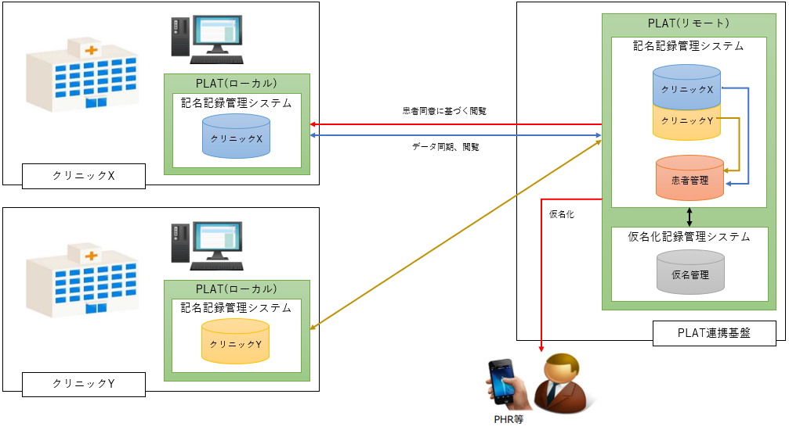

# 全体構成

## 1. システム構成図（参照実装時の例）

## 2. 各環境の役割

### 2.1. ローカル

各医療機関側に設置する PLAT のシステム

### 2.2. リモート

患者が利用する PLAT システム
各医療機関のマスタとしての役割も果たす

## 3. 今回の動作環境構築の想定

### 3.1. 概要

本手順では１つの OS 上で Docker を用いて簡易的に Local-Remote の環境を作成する手順を記載する。

### 3.2. 簡易構成

### 3.3. 詳細構成

| 区分     | 対象      | APIサーバ                | Gatewayサーバ            | OpenFRUCtoSサーバ        | KeyCloakサーバ            |
|:-------|---------|-----------------------|-----------------------|-----------------------|------------------------|
| Local  | ClinicX | http://localhost:8181 | http://localhost:8182 | http://localhost:9083 | http://localhost:8184  |
|        | ClinicY | http://localhost:8281 | http://localhost:8282 | http://localhost:9085 | http://localhost:8284  |
| Remote | Remote  | http://localhost:8081 | http://localhost:8082 |                       | http://localhost:8084  |
|        | RemoteX |                       |                       | http://localhost:9082 |                        |
|        | RemoteY |                       |                       | http://localhost:9084 |                        |
|        | Patient |                       |                       | http://localhost:9081 |                        |

## 4. ミドルウェアの役割

### 4.1. Keycloak

PLAT での認証（シングルサインオン）基盤として利用。

### 4.2. PostgreSQL

各種アプリケーション、ミドルウェアのデータベースとして利用。

### 4.3. RabbitMQ

データ同期処理においてローカルからリモートへ JSON 形式のデータを連携するために利用。

## 5. アプリケーションの役割

### 5.1. plat-gateway

認証基盤で発行したトークンを基に PLAT の認可機能を提供する。

### 5.2. plat-api

PLAT における業務 API を提供する。
機能詳細については[API 一覧](API/API.md)を参照。

### 5.3. plat-mq

PLAT の Local→Remote 連携用メッセージキューイング処理用バッチ。  
Local の RabbitMQ からキューを取得し、Remote の plat-api に連携する。

### 5.4. plat-autoapproval

PLAT の文書自動承認処理バッチ。  
文書登録から一定期間経過したデータを取得し、自動承認する。

### 5.5. plat-sync

PLAT の Remote→Local 連携用バッチ。  
リソース連携管理テーブルに登録されたデータを取得し連携する。

### 5.6. plat-cleaning

PLAT の Local 用データクリーニングバッチ。  
登録から一定期間経過したデータを取得し、削除する。
