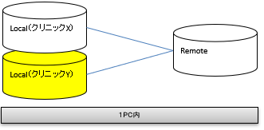

# 医療機関を追加する

## 1. 概要

本手順では「新規に基盤を構築する」にて環境構築後に新たな医療機関を追加する手順を記載する。

## 2. 構成

本手順を実施することで以下の医療機関（黄色の網掛け）をローカル PC 上に追加構築する。

### 2.1. 簡易構成



### 2.2. 詳細構成


## 3. 環境情報

| 環境名         | フォルダ名 | メモリ使用量 |
| -------------- | ---------- | ------------ |
| ローカル環境 Y | localY     | 5 GB         |

## 4. 手順

本手順はplanets-lib フォルダにて行う。

### 4.1. Docker の実行（localY）

1.  シェルを起動し、Docker のデータ初期化を行う

    ```
    # ./docker_clean.sh localY
    ```

1.  シェルを起動し、Docker の起動を行う

    ```
    # ./docker_start.sh localY
    ```

1.  シェルを起動し、PLAT への初期データ登録を行う

    ```
    # ./docker_data_of.sh localY
    ```

### 4.2. 動作確認

[利用手順 / Postman でのアプリケーション疎通確認](../Usage/operation_check.md)
